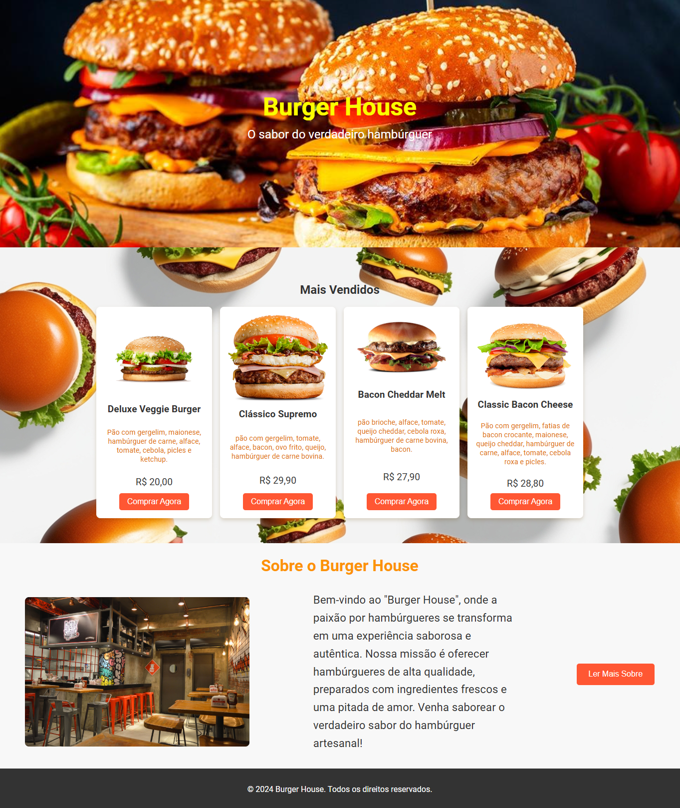

📄 Descrição
O projeto visa apresentar um site para uma hamburgueria, onde os usuários podem ver o menu, preços e imagens de hambúrgueres deliciosos. A interface foi desenhada com foco em uma experiência visual agradável e prática, permitindo que o cliente navegue pelo menu e conheça mais sobre a hamburgueria.

Tecnologias Utilizadas
HTML: Estrutura do site.
CSS: Estilização e layout responsivo.

📁 Estrutura de Arquivos
index.html: Arquivo principal do site com a estrutura HTML.
style.css: Arquivo de estilo com toda a formatação e layout do site.

🖼️ Estrutura do Site
Cabeçalho
Imagem de destaque do hambúrguer com o nome e slogan da hamburgueria.
Menu de Hambúrgueres
Imagens e descrições dos hambúrgueres mais populares, com preços e detalhes para atrair o cliente.
Sessão "Sobre"
Um pouco sobre a história e os diferenciais da hamburgueria.
Rodapé
Informações
🖥️ Responsividade
O site é responsivo e foi testado para oferecer uma boa experiência tanto em dispositivos móveis quanto em desktop.

📷 Pré-visualização

